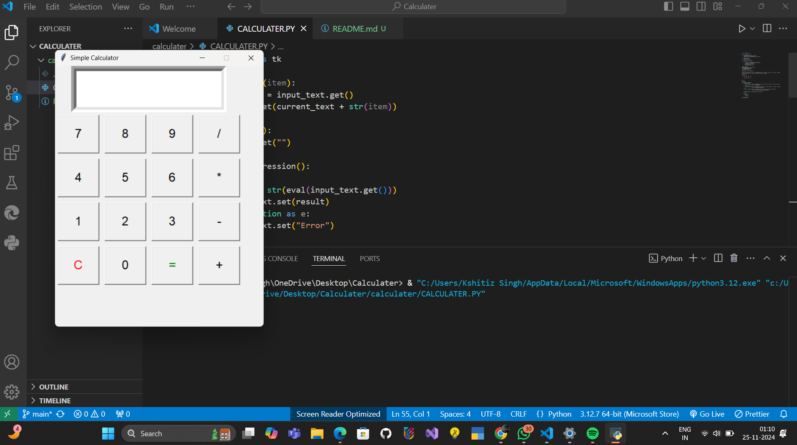
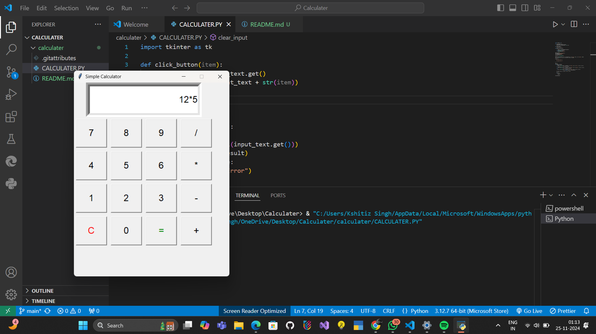

# CALCULATER

## Overview

The **CALCULATER** is a Python-based tool that allows users to generate random password with a graphical user interface (GUI). This project uses the `random` library for organizing the files and `tkinter` for creating the GUI.

## Features

- Easy-to-use graphical interface with `tkinter`.
- Calculate the all number.

## Usage

1. Launch the program by running `main.py`.
2. The GUI will open with one field:
   - **calculate the number : Enter the number and calculate the number
3. Click **Submit** button to get result.
4. 

## Screenshots

---